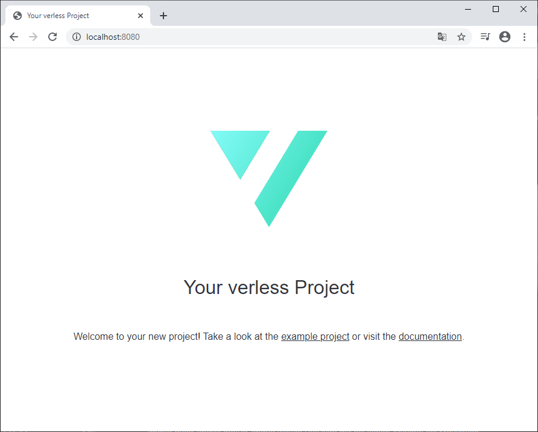
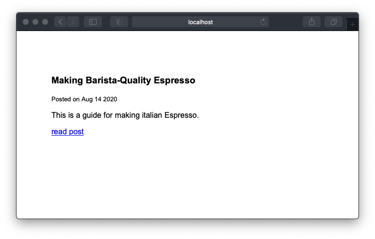

# Create a website using verless

In this tutorial, we'll create a simple verless project. Of course, you need to [install verless](../README.md) first or
[run it with Docker](../README.md).

## Contents

* [Scaffolding a new project](#scaffolding-a-new-project)
* [Developing and customizing a project](#developing-and-customizing-a-project)
* [Project configuration](#project-configuration)
* [Creating content](#creating-content)
* [Editing content](#editing-content)
* [Themes](#themes)
* [Templating](#templating)
* [Serving or building the website](#serving-or-building-the-website)
* [Plugins](#plugins)

## Scaffolding a new project

First of all, we're going to initialize a new project - a Coffee Blog - to get started quickly. verless makes this
fairly easy:

```
$ verless create project coffee-blog
```

This creates a small, customizable standard project. Basically, a project is nothing else than a directory containing
some components required for verless. In this case, our directory is called `coffee-blog`.

## Developing and customizing a project

You don't need a third-party webserver like Apache for local development, because verless already comes with a built-in
webserver.

One of the disadvantages of Static Site Generators is that you have to re-build your entire website each time you change
a single file in your project. Fortunately, verless is able to watch your project for changes when serving the website,
and it will automatically re-build the project each time you change a file.

This will serve our project on [localhost:8080](http://localhost:8080):

```
$ verless serve -w coffee-blog
```

The `-w` or `--watch` flag will verless make watch the project for changes.



## Project configuration

verless created a top-level configuration file called `verless.yml` for you. Here you can set metadata, define your
navigation items, enable [plugins](plugin-reference.md) and set your [theme](theme-reference.md).

Let's change into the `coffee-blog` directory and put some stuff into `verless.yml`:

```yaml
version: 1
site:
  meta:
    title: My Coffee Blog
    subtitle: About Espresso & Cappuccino
    description: I'm Clara and write alot about coffee.
    author: Clara Crema
    base: http://localhost
  nav:
    items:
      - label: Home
        target: http://localhost
plugins:
  - atom
theme: default
build:
  overwrite: true
```

## Creating content

Time to create our first article! All content is stored as Markdown files inside the `content` directory of our project.
If you haven't quit `serve` yet, press `Ctrl` + `C` to stop it. Run the following command inside the project directory
to create a new file:

```
$ verless create file making-barista-quality-espresso.md
```

This creates a new Markdown file as `content/making-barista-quality-espresso.md`. The filename defines the URL of the
page, and it is relative to the `content` directory - so this one will be available at
`localhost:8080/making-barista-quality-espresso`. It is that simple.

## Editing content

The advantage of `verless create file` is that it initializes a Markdown file with a default Front Matter. The Front
Matter is a small YAML section inside the Markdown where you can define metadata:

```markdown
---
Title:
Description:
Date: 2020-10-12
---
```

Let's write some content about Barista-Quality Espresso:

```markdown
---
Title: Making Barista-Quality Espresso
Date: 2020-08-14
Description: This is a guide for making italian Espresso.
Tags:
    - Espresso
    - Coffee
Img: /static/espresso.jpg
Credit: Burst on Pexels
---

Do you enjoy a high-quality italian Espresso as much as I do? Quite
frankly, making Espresso at this level isn't easy - but with the right
tools, patience and practice, you'll be able to make delicious coffee
at home.

...
```

I've also copied a photo into the `static` top-level directory of our project, using it as an image in the `Img` field.
It will be available under `localhost:8080/static/espresso.jpg`.

## Themes

Maybe you've already seen that our project contains a `themes` directory where verless stores all themes. After creating
a new project, it already contains the `default` theme.

For our Coffee Blog, we could merely customize the `default` theme, but we're going to create an own theme called
`light` for this tutorial. Just issue this command inside our project directory:

```
$ verless create theme light
``` 

This creates a new `light` directory inside `themes`, containing all components that a theme requires: A configuration
called `theme.yml` and the `templates` and `assets` directories.

With these basics, we're good to start templating and styling.

## Templating

Each theme requires at least two templates:
* A template for rendering Markdown content: `page.html`
* A template for rendering overview pages for each directory: `list-page.html`

Let's edit `templates/page.html` inside our new theme and write something like this:

```html
<!DOCTYPE html>
<html>
    <head>
        <title>{{.Page.Title}}</title>
        <link rel="stylesheet" href="/assets/style.css" />
    </head>
    <body>

        <h1>{{.Page.Title}}</h1>

        
    
        <p>{{.Page.Description}}</p>
        <small>
            Posted on {{.Page.Date.Format "Jan 2 2006"}}.
            Photo: {{.Page.Credit}}
        </small>
        <p>{{.Page.Content}}</p>

    </body>
</html>
```

As you see, verless provides a stable and type-safe template API: In `page.html`, there are objects like `.Page` and
`.Meta` available, and they possess fields like `.Title`. This makes verless themes re-usable across projects.

To get a complete list of available fields in the particular templates, check out the
[template reference](template-reference.md#field-reference).

Next, we'll edit `templates/list-page.html`. For each directory inside `content` - for example, our `blog` directory -,
verless generates a overview page containing all pages in that directory. These are so-called _list pages_.

In our `list-page.html`, we want to provide a simple list of page titles with hyperlinks the individual pages:

```html
<!DOCTYPE html>
<html>
    <head>
        <title>{{.Page.Title}}</title>
        <link rel="stylesheet" href="/assets/style.css" />
    </head>
    <body>

        {{range $page := .Pages}}
            <div>
                <h3>{{$page.Title}}</h3>
                <p><small>Posted on {{$page.Date.Format "Jan 2 2006"}}</small></p>
                <p>{{$page.Description}}</p>
                <p><a href="{{$page.Href}}">read post</a></p>
            </div>
        {{end}}

    </body>
</html>
```

## Serving or building the website

If you're inside the project directory, serve the website using the following command and check if everything works as
expected:

```
$ verless serve -w .
```

The generated website should look similar to this:



To get a deployable binary that you can upload to your web hosting or cloud provider, you can build the project using
`verless build`:

```
$ verless build .
```

The built website will go into the `target` directory of our project and you're good to upload it.

## Plugins

verless supports some plugins that are desirable for many, but not all project out there - so verless wants you to
explicitly active the plugins you need. Maybe you noticed that small `plugins` section in `verless.yml`:

```yaml
plugins:
  - atom
```

This small plugin automatically generates a RSS feed for you. When serving our project, check it out here:
[localhost:8080/atom.xml](http://localhost:8080/atom.xml)

You may also check out the [plugin reference](plugin-reference.md).

**You're now good to create your own styles, configure your [pre-build hooks](theme-reference.md#pre-build-hooks) for
generating CSS and create your very own website!**
